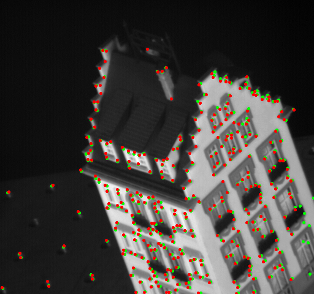

# feature-detection-tracking
### This repository contains programs related to:  

* Feature detection (implementation of Harris corner detection)  
* Feature tracking : optical flow (implementation of Lucas-Kanada algorithm)
* Shape alignment (Affine transformation)
* Feature matching (Matchin SIFT descriptors using 2 metrics)

#### All the implementations are programmed from scratch without using any in-built functions except for minor operations such as convolution

### 1. Feature detection 
#### We first compute the image gradients using which we form the second moment matrix. The harris score I have considered is the ratio of determinant of second moment matrix to trace of the matrix.

Corner detection             |  
:-------------------------:|
  |  

### 2. Feature tracking : optical flow (implementation of Lucas-Kanada algorithm)
#### After getting the key points in the image, we start to track them across a sequence of images. We do this by taking patches of images t and t+1 and solve for the displacement by least squares and add them to the tracking points.
Second set of Tracked Points            | 
:-------------------------:|
 |

Progress for 20 points        | Full sequence |
:-------------------------:|:-------------------------:|
 |  |

### 3. Shape alignment (Affine transformation)
#### First, a transformation matrix is initialized and ICP (Iteratice Closest Point) alogrithm is implemented to compute affine transformation between two images. Image is transformed using this affine transformation matrix.
Image 1        | Image 2 |
:-------------------------:|:-------------------------:|
 |  |

Image 1 aligned as Image 2       |
:-------------------------:|
 | 

### 4. Feature matching (Matchin SIFT descriptors using 2 metrics)
#### The SIFT descriptors are matched using two metrics. One is distance ratio of two nearest neighbors and the second one being distance of the nearest neighbhor  

Matches using only distance        | Matches using distance ratio of two nearest neighbors |
:-------------------------:|:-------------------------:|
  |  |

